```{r set-options, message=FALSE, error=FALSE, include=FALSE}
options(width = 60)
REDO <- FALSE
library(RSelenium, warn.conflicts = FALSE, quietly=TRUE)
```


# Introduction

##Course Taster

find a course taster at: 

http://pmeissner.com/downloads/user2015_meissner_webscraping.pdf


##Course Teaser

... back to the course teaser


##THE WEB 

- **web pages** (e.g. http://example.com, http://ecpr.eu/)
- **web formats** (XML, HTML, JSON, ...)
- **web frameworks** (HTTP, URL, APIs, ...)
- **social media** (Twitter, Facebook, LinkedIn, Snapchat, Tumbler, ...)
- **data in the web** (politician's biography, laws, policy reports, news, ... )
- **web data** (page views, page ranks, IP-addresses, ...)


##THE PROBLEMS

**phase**     | **problems** | **examples**
--------------|--------------|-----------
**download**  | protocols    | HTTP, HTTPS, POST, GET, ... 
&nbsp;        | procedures   | cookies, authentication, forms, ...
--------------|--------------|------------------------------
**extraction**| parsing      | translating HTML (XML, JSON, ...) into R
&nbsp;        | extraction   | getting the relevant parts
&nbsp;        | cleansing    | cleaning up, restructure, combine


##THE SOLUTION

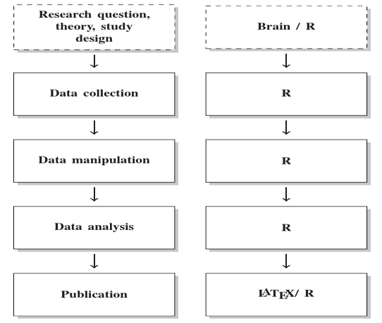


#Applications


##MP Biographies
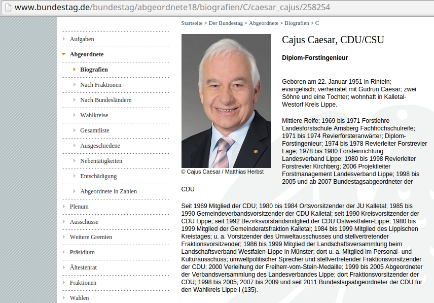

[Bailer, Meißner, Ohmura, Selb (2013): Seiteneinsteiger im Deutschen Bundestag. Springer VS](http://www.springer.com/us/book/9783658010256)

##MP Biographies
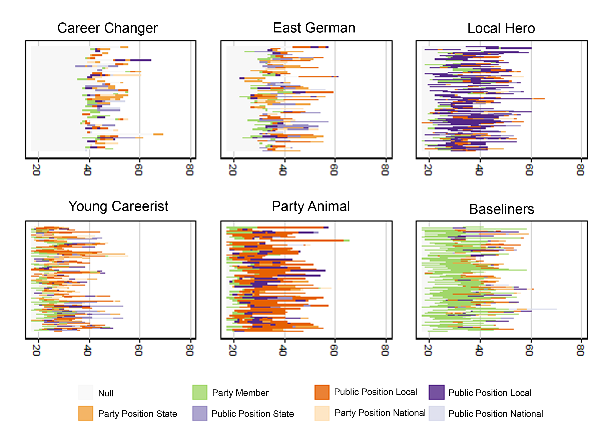

[Bailer, Meißner, Ohmura, Selb (2013): Seiteneinsteiger im Deutschen Bundestag. Springer VS](http://www.springer.com/us/book/9783658010256)

##Legislative Process
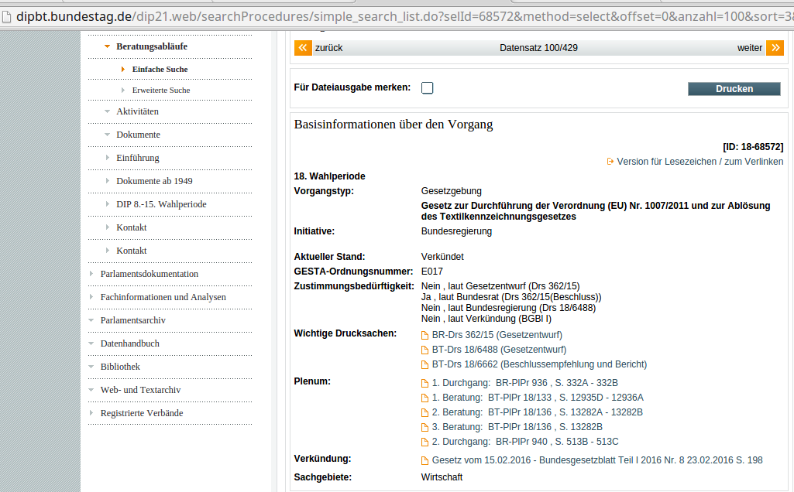

##Legislative Process


##Legislative Process
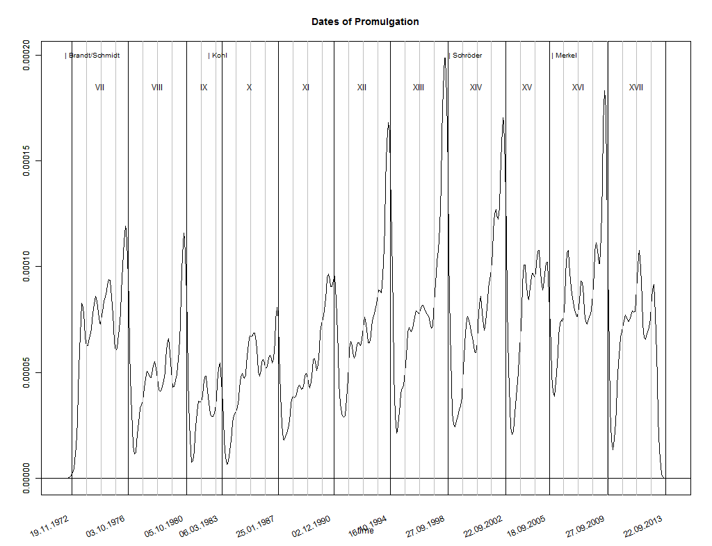

##Legislative Process


##Legislative Process


##Wikipedia Page Views - IS
```{r isis, include=FALSE, fig.path="fig/", cache=TRUE}
library(wikipediatrend)
wp_set_cache_file( file = "isis.csv" )
titles <- wp_linked_pages("Islamic_State_of_Iraq_and_the_Levant", "en")
titles <- titles[titles$lang %in% c("en", "de", "ar"),]
titles <- 
  rbind(
    titles, 
    data.frame(
      page="Islamic_State_of_Iraq_and_the_Levant", 
      lang="en", 
      title="Islamic_State_of_Iraq_and_the_Levant"
    )
  )
page_views <- 
  wp_trend(
    page = titles$page, 
    lang = titles$lang,
    from = "2014-08-01"
  )

library(ggplot2)

for(i in unique(page_views$lang) ){
  iffer <- page_views$lang==i
  page_views[iffer, ]$count <- scale(page_views[iffer, ]$count)
}

ggplot(page_views, aes(x=date, y=count, group=title, color=lang)) + 
  geom_line(size=1.2, alpha=0.5) + 
  ylab("standardized count\n(by lang: m=0, var=1)") +
  theme_bw() + 
  scale_colour_brewer(palette="Set1") + 
  guides(colour = guide_legend(override.aes = list(alpha = 1)))

```


##Correcting Spatial Error Correlations
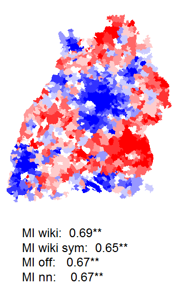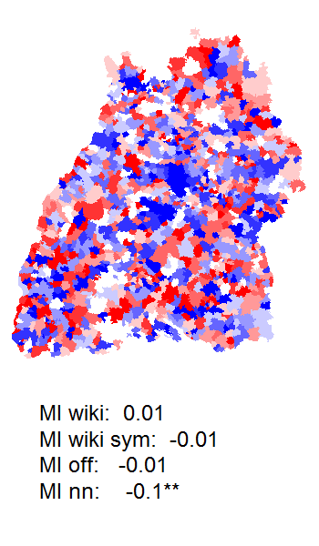

[Shikano & Meißner (2013)](http://pmeissner.com/downloads/Shikano_Meissner_2013.pdf)


##Estimating Policy Effects
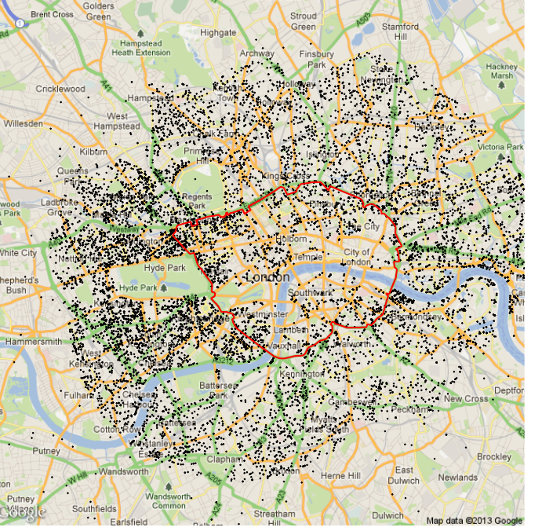


##Mass Idealpoint Estimation
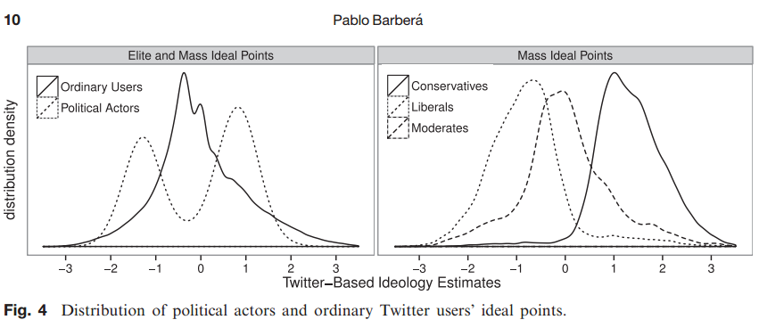

[Barbera (2014)](http://pan.oxfordjournals.org/content/early/2014/09/11/pan.mpu011.full.pdf+html)


##News Based War Prediction

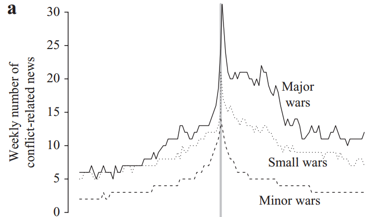

[Chadefaux (2014)](http://jpr.sagepub.com/content/51/1/5.full)


##Collective Action and Organization Formation

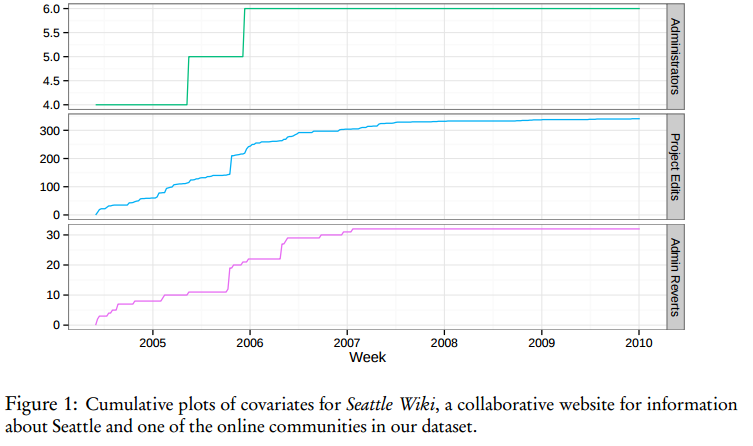

[Shaw & Hill (2014)](https://mako.cc/academic/)


##Electoral Rule Effects

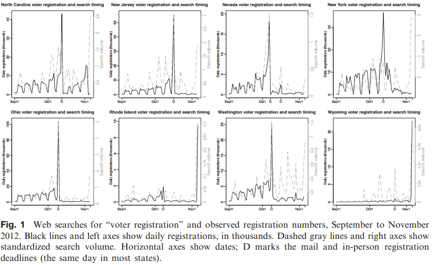

[Street et al. (2015)](http://pan.oxfordjournals.org/content/early/2015/03/11/pan.mpv002.full)


##Mobil Phone Meta Data
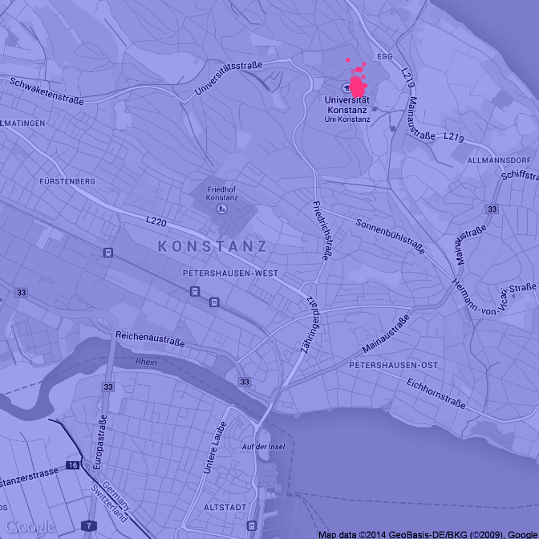

##Mobil Phone Meta Data
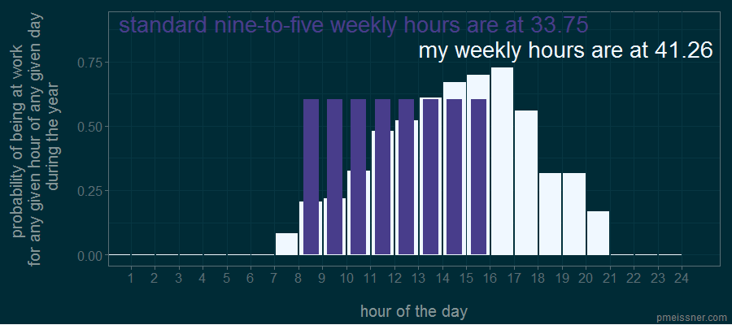


##Name Distribution


##...

...


# Conclusion

##Conclusion
- applications are diverse and many fold
- the web is everywhere
- web data formats are not only in the web (e.g. EPub, Docx, KML are XML)
- data extraction skills (e.g. RegEx) are swiss army knives


