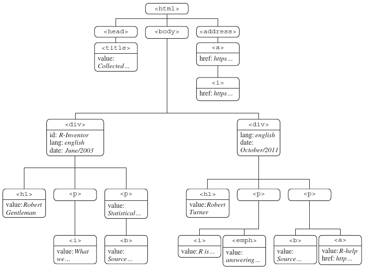

# HTML/XML tree structure again
## HTML/XML tree structure, nodes and attributes
http://www.r-datacollection.com/materials/html/fortunes.html



# Running Example 

## running example
```{r, message=FALSE}
require(rvest)
require(stringr)
```


```{r}
url <- 
"http://pmeissner.com/downloads/fortunes.html"
fname <- basename(url)

if(!file.exists(fname)){
  download.file(url, fname)
}

html <- read_html(fname)
```

## running example

```{r}
xml2::html_structure(html)
```


# How XPath works ...


## XPath? What is it all about? 
- XPath is a query language for XML (Extensible Markup Language) documents 
- XML examples are: [XML, HTML, SVG, GML, KML, EPUB, RSS, Office Open XML, OpenDocument](https://en.wikipedia.org/wiki/List_of_XML_markup_languages)
- in XPath on selects nodes describing the paths that lead to that path


## How XPath Works ... 
- builds on 
    - **hierarchy** (select parent, child, sibling, ... node)
    - **node names** (select node by name)
    - **node values** (select node by value)
    - **attribute name and value** (select node on attribute value)
    - **further functions** (select depending on more complex derivates of the above)
        - e.g. name, string_length, contains, count, position, ... 
    - **operators**
        - e.g. `|`, `+`, `-`, `=`, `!=`, `<=`, `or`, `and`, ...
- allows to extract
    - node values 
    - attribute values
- ... from single nodes and node sets


## explicit path
```{r}
x="/html/body/div[2]/h1"
html_nodes(html, xpath=x)
```

## path anywhere in hierarchy
```{r}
html_nodes(html, xpath="//h1")
```

## path anywhere in hierarchy / attribute 
```{r}
html_nodes(html, xpath="//a/@href")
```

## path anywhere in hierarchy / function
```{r}
html_nodes(html, xpath="//p/i/text()")
```

## path anywhere in hierarchy / indexing
```{r}
html_nodes(html, xpath="//div[1]/p/i")
```

## path anywhere in hierarchy / indexing
```{r}
html_nodes(html, xpath="//div")
html_nodes(html, xpath="//div[1]")
html_nodes(html, xpath="//div[1]/p/i/text()")
```

## node / attribute contains/is equal ... 
```{r}
html_nodes(html, xpath="//div[@date='October/2011']")
html_nodes(html, xpath="//div[contains(@date, 'October/2011')]")
html_nodes(html, xpath="//div[contains(.//a/@href, 'https')]")
```

## node / attribute contains/is equal ... 
```{r}
html_nodes(html, xpath="//a[contains(@href, 'https')]")
html_nodes(html, xpath="//a[contains(., 'homepage')]")
```


## node parent 
```{r}
html_nodes(html, xpath="//a")
html_nodes(html, xpath="//a/..")
```

## all nodes everywhere
```{r}
html_nodes(html, xpath="//*")
```


## all nodes' text everywhere
```{r}
html_nodes(html, xpath="//*/text()")
```


## that node or the other 
```{r}
html_nodes(html, xpath="//i | //b")
```

## using axis :: parent
```{r}
html_nodes(html, xpath="//a/..")
html_nodes(html, xpath="//a/parent::*")
html_nodes(html, xpath="//a/parent::p")
```

## using axis :: child
```{r}
html_nodes(html, xpath="//p/i")
html_nodes(html, xpath="//p/child::*")
html_nodes(html, xpath="//p/child::i")
```

## using axis :: ancestor
```{r}
html_nodes(html, xpath="//b/ancestor::*")
html_nodes(html, xpath="//b/ancestor::*/text()")
```

## using axis :: descendant
```{r}
html_nodes(html, xpath="//p/descendant::*")
html_nodes(html, xpath="//p/descendant::*/text()")
```

## using axis :: following-sibling / preceding-sibling
```{r}
html_nodes(html, xpath="//b/..")
html_nodes(html, xpath="//b/following-sibling::*")
```


# How CSS-Selectors Work ... 

## How CSS-Selectors Work ... 
- CSS-Selectors were designed to apply Styles to HTML elements
- While XPath is build around the idea of hierarchy and tree-structure first and foremost meaning that paths lead to data, with CSS-S selection is more set-like. 
- CSS-S is used and written for Web-Designers so it might be less-powerful-complete-systematic than XPath but it is also less intimidating and easier to write
- selection on class and id attributes is super easy
    - **name** (select nodes by name)
    - **id** (select node id attribute)
    - **node values** (select node by value)
    - **attribute name and value** (select node on attribute value)
    - **hierarchy** (select depending on the position in path)

## selecting nodes by name
```{r}
html_nodes(html, "p")
html_nodes(html, "b, i")
```

## selecting nodes by class
```{r}
html_nodes(html, ".pink")
```

## selecting nodes by id
```{r}
html_nodes(html, css = "#R_Inventor")
html_nodes(html, css = "[id='R_Inventor']")
```

## selecting nodes by attribute
```{r}
html_nodes(html, css = "[lang]")
html_nodes(html, css = "[href]")
```

## selecting nodes by attribute value
```{r}
html_nodes(html, css = "[id=R_Inventor]") # equal
html_nodes(html, css = "[id^=R]")         # starts 
html_nodes(html, css = "[id$=r]")         # ends
html_nodes(html, css = "[id*=ven]")       # conatains
```

## selecting nodes by path characteristics : decendant
```{r}
html_nodes(html, css = "i")
html_nodes(html, css = "a i")
```

## selecting nodes by path characteristics :parent
```{r}
html_nodes(html, css = "p > i")
html_nodes(html, css = "a > i")
```

## selecting nodes by path characteristics : first of type
```{r}
html_nodes(html, css = "p:first-of-type")
```


## selecting nodes by path characteristics : nth child of parent
```{r}
html_nodes(html, css = "a:nth-child(1)")
html_nodes(html, css = "a:nth-child(2)")
```

## selecting nodes by path characteristics : nth child of parent
```{r}
html_nodes(html, css = "a:nth-last-child(1)")
html_nodes(html, css = "a:nth-last-child(2)")
```


## selecting nodes by path characteristics : nth child of parent
```{r}
html_nodes(html, css = "p:nth-of-type(1)")
```


# R-Packages and Functions
## rvest and XML

**rvest** (httr + xml2 + selectr)

  - scraping centered package (download and extraction)
  - HTML / XML
  - XPath / CSS-S
  - very handy and slick
  - we use this 
    
**XML** (xml)

  - XML centered package (parsing and extraction)
  - XPath
  - much more powerful in terms of parsing (also SAX for LARGE documents)
  - goes back to 1999 (according to README; you know just after the internet became a thing)
  - two good sources cover that one: Nolan & Temple-Lang (2013): *XML and Web Technologies for Data Sciences with R*; Munzert et al (2014): *Automated Data Collection with R*

  
## rvest's (important) XML handling functions

function           | description
------------------ | ------------
`read_html()`      | parse HTML (file); all others based on
`html_structure()` | shows the structure of an HTML (doc)
`as_list()`        | transform parsed XML / HTML to list (doc)
`html_attr()`      | get specific attribute value (node)
`html_attrs()`     | get all attributes (node)
`html_text()`      | get node's and children's text (node)
`html_children()`  | get children of node (doc, node)
`xml_path()`       | gives back the explicit path to nodes (node)
`xml_length()`     | number of children (node)
`html_name()`      | name of nodes (node)
`xml_parent()`     | gives back parent of node (node)
`xml_parents()`    | gives back all ancestors of node (node)
`xml_siblings()`   | gives back nodes with the same parent (node)
`xml_type()`       | gives back type (node, doc)

doc: parsed document; node: node set or node; file: un-parsed XML document


# Selector Gadget and Developer Tools to the Rescue

## Selector Gadget and Developer Tools to the Rescue
- building Xpath (CSS-S) expressions is an art (practice hard and be creative)
- ... and easily and quickly becomes mind buggling and complicated ...
- ... there are however some tools that might help lessen the burden:
    - selectorgadget : http://selectorgadget.com/
    - developer tools : 
        - Chrome: https://developer.chrome.com/devtools 
        - Firefox: https://developer.mozilla.org/de/docs/Tools
        - Opera: http://www.opera.com/dragonfly/
        - Safari: https://developer.apple.com/safari/tools/
        - Edge: https://dev.windows.com/en-us/microsoft-edge/platform/documentation/f12-devtools-guide/
        


