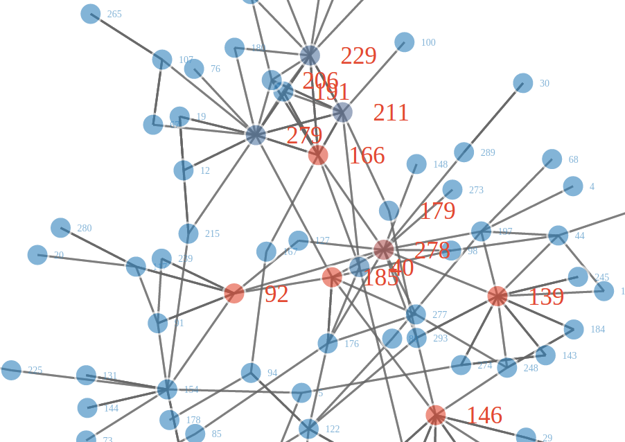
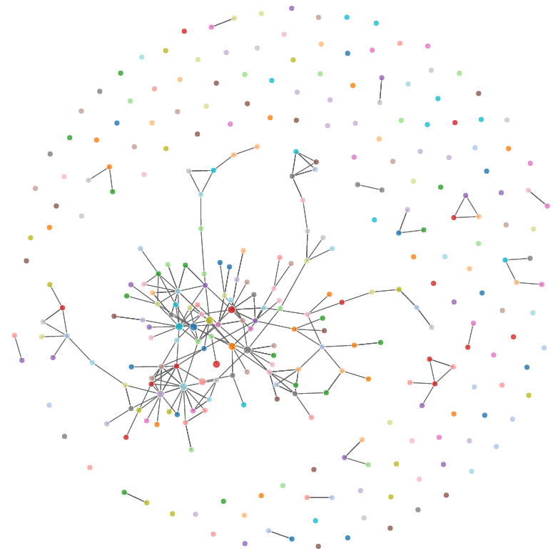
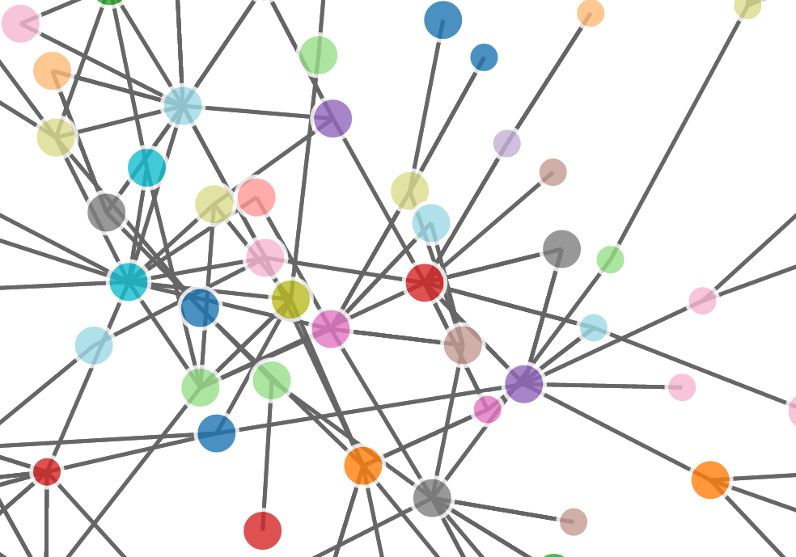

# Overview
## ... in which we ...
- extract **links** using **XPath**
- folow them to **extract links** again 
- and build a **network** of notable political scientists

## ... and learn about ... 
- **Xpath**
- **Selector Gadget**

## ... while using packages ... 
- **rvest** (information extraction from HTML)
- **stringr** (string manipulation)
- **d3Network** (network data visualizetion)


# Live coding

## a first glance at the page
```{r, message=FALSE}
require(rvest)
require(stringr)
```

```{r, eval=1:2}
url <- 
"https://en.wikipedia.org/wiki/List_of_political_scientists"

browseURL(url)
```

## a first try at extracting links 
- lets get all the links 

## a first try at extracting links 
- How shall we do it?


## a first try at extracting links 
- How shall we do it?

- think first
- looking for similarities
- looking for differences
- using every available tool in conjunction


## a first try at extracting links 
- How shall we do it?

- `<a>`-nodes
- href should entail `/wiki/`
- child of `<li>`, child of `<ul>`
- always 1st child
- XPath: **`//ul/li/a[1]`**
- than do further filter by RegEx


## a first try at extracting links 
```{r}
html   <- read_html(url)
ankers <- html_nodes(html, xpath="//a")
length(ankers)
```
- thereafter using RegEx to get rid of those links that did not lead to PDF files
- **we could also use XPath for filtering**

## a first try at extracting links 
- the links a nodes we are looking for
```{r}
ankers[100:102]
```
```{r}
xml_path(ankers[100:102])
```


# Extracting links of notable political scientists

## get reasonable subset of links

```{r}
ankers <- html_nodes(html, xpath="//ul/li/a[1]")
links  <- html_attr(ankers, "href")
# according to SelectorGagdget should be around
length(links) 
```


## fine tuning selection of links
```{r}
links_iffer <- # subsetting links by position
  seq_along(links) >= 
    seq_along(links)[str_detect(links, "Abramowitz")]  & 
  seq_along(links) <=
    seq_along(links)[str_detect(links, "John_Zaller")] & 
  str_detect(links, "/wiki/")

links_index <- seq_along(links)[links_iffer]
links <- links[links_iffer]

length(links)
```


## Further information on notable political scientists

## names
```{r}
names <- html_attr(ankers, "title")[links_index]
names <- str_replace(names, " \\(.*\\)", "")
# maybe needed - Windows e.g. depends on your locale: 
# Sys.getlocale()
# stringi::stri_enc_detect(paste(names, collapse = ""))
# names <- iconv(names, "utf8", "latin1")
```

## other information might come from their personal wiki-pages 
- **links to other notable political scientists**
- universities 
- place of birth 
- key puplications,
- ... 

## Downloading PS pages - preparation
```{r}
# loop preparation
baseurl <- "https://en.wikipedia.org"
HTML    <- list()
Fname   <- str_c("downloads/", basename(links), ".html")
dir.create("downloads", FALSE)
URL     <- str_c(baseurl, links)
```

## Downloading PS pages - loop
```{r}
# loop
for ( i in seq_along(links) ){
  # url
  url <- URL[i]
  # fname
  fname <- Fname[i]
  # download
  if ( !file.exists(fname) ){
    download.file(url, fname)
    Sys.sleep(0.8)
  } 
  # read in files
  HTML[[i]] <- read_html(fname)
}
```


## Gathering data on links to other notable PS
```{r}
# loop preparation
connections <- data.frame(from=NULL, to=NULL)

# loop
for ( i in seq_along(HTML))  {
  pslinks          <- html_attr(
                        html_nodes(HTML[[i]], xpath="//a"), 
                      "href")
  links_in_pslinks <- seq_along(links)[links %in% pslinks]
  links_in_pslinks <- links_in_pslinks[links_in_pslinks!=i]
  connections      <- rbind(
                connections, 
                data.frame(
                  from=rep(i, length(links_in_pslinks)), 
                  to=links_in_pslinks
                  ) 
                      )  
}
```

## Gathering data on links to other notable PS
```{r}
# results
names(connections) <- 
  c("from", "to")
head(connections)
```

## Gathering data on links to other notable PS
```{r}
# make symmetrical 
connections <- 
  rbind(
    connections, 
    data.frame(
      from=connections$to,
      to=connections$from
    )
 )
```


## Plot connections 
```{r}
require(d3Network)
d3SimpleNetwork( connections, 
                 width = 1000, 
                 height = 900, 
                 file="connections.html")
# browseURL("connections.html")
```

## Plot connections 


## Plot connections 
```{r, tidy=TRUE}
d3ForceNetwork(Links = connections, Nodes = data.frame(name=names),
               Source = "from", Target = "to", 
               opacity = 0.9, zoom=T,  width=1000, height=900, 
               file="connections2.html")
# browseURL("connections2.html")
```

## Plot connections 


## Plot connections 


## Plot connections 



# Extension

## localize notable political scientists
- go through all PS pages and extract university mentions
    - links 
    - ... that have *University*, *School*, *???* in text
- think about how to best store/organize this information
- go get it
- geocode universities similar to scenario 1 


## localize notable political scientists
- Wikipedia pages sometimes entail geographic information
- go through all PS pages and extract all links
    - keep those links that lead to Wikipedia pages
- go through all page links left and look for geolocations connected to the notable political scientist


## plot all locations gathered on a map 
- have a look at RegEx-Case-Study for ideas on how to do it


