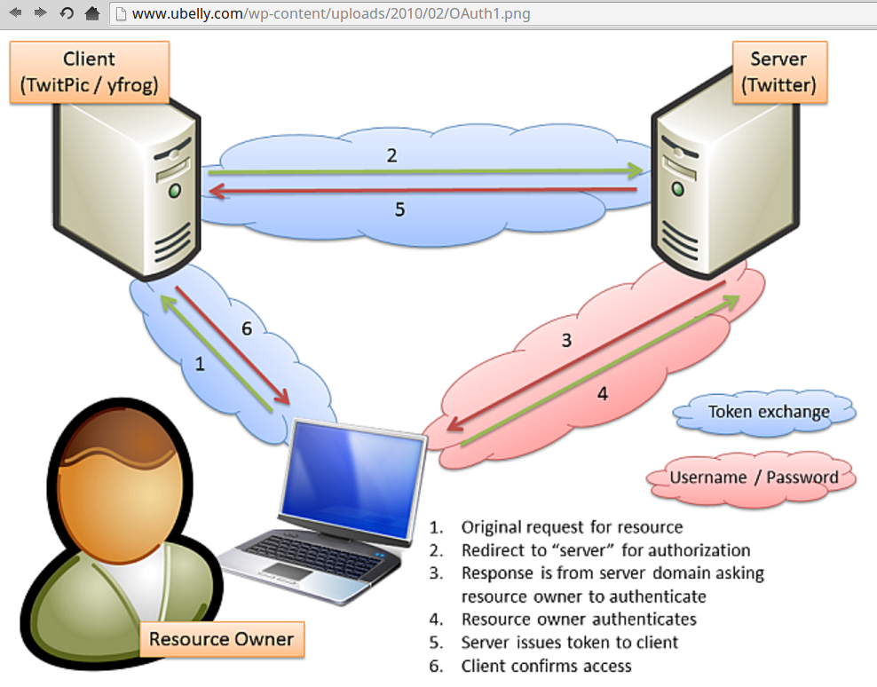
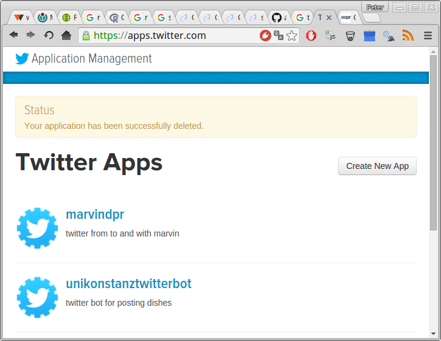
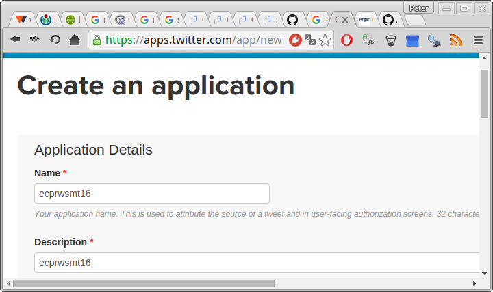
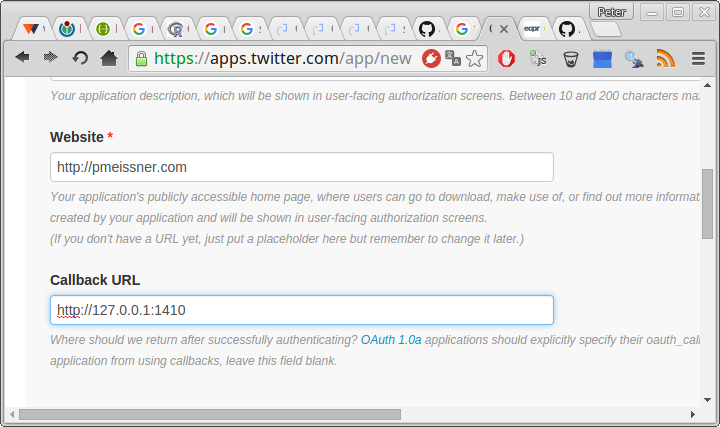
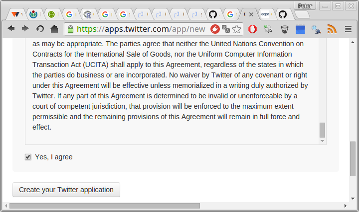
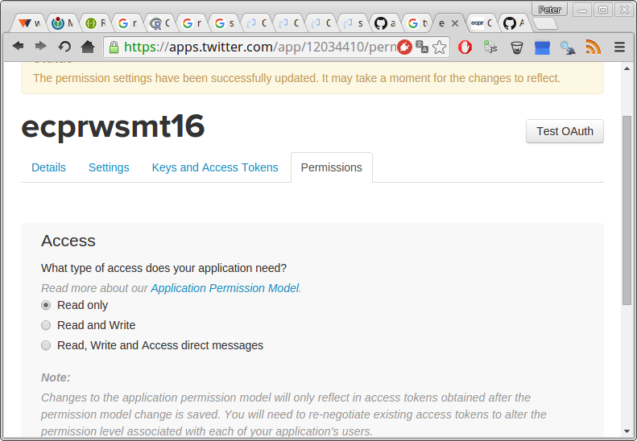
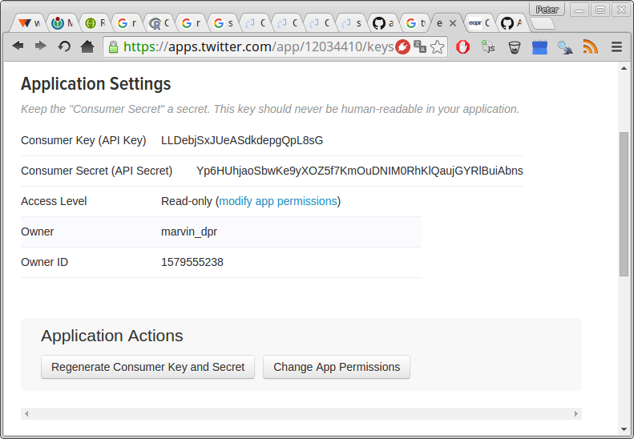
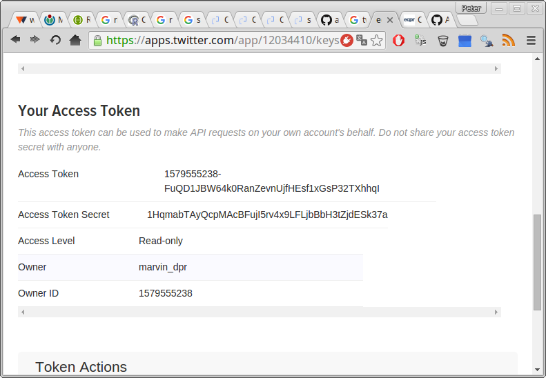

# Twitter API - API with authentication

## API with authentication
- provides API for tweeting, accessing tweets and user information
- more complex interface 
- access needs Oauth authentication
    - get account / developer account
    - create/register application
    - use credentials to authorize 

## API with authentication
- *[httr]* has capabilities and some examples: https://github.com/hadley/httr/tree/master/demo
- use an already written package 
- ... twitteR package by Jeff Gentry (!must read!: http://geoffjentry.hexdump.org/twitteR.pdf)

## OAuth


## twitter app


## twitter app


## twitter app


## twitter app


## twitter app


## twitter app


## twitter app



## the twitter example
```{r, message=FALSE}
# packages
library(httr)
library(dplyr)
library(magrittr)
library(stringr)
# credentials
cred_file <- "ecpr_wsmt_2016.credentials"
tmp       <- readLines(cred_file)
tmp
```


## the twitter example
```{r}
key = stringr::str_replace(
  grep("twitter_api_key=", tmp, value = T), 
  "twitter_api_key=", "")

secret = stringr::str_replace(
  grep("twitter_api_secret=", tmp, value = T), 
  "twitter_api_secret=", "")

token = stringr::str_replace(
  grep("twitter_access_token=", tmp, value = T), 
  "twitter_access_token=", "")

token_secret = stringr::str_replace(
  grep("twitter_access_token_secret=", tmp, value = T), 
  "twitter_access_token_secret=", "")
```


## the twitter example
```{r, cache=TRUE}
twitter_token <-
  Token1.0$new(
    endpoint      = NULL,
    params        = list(as_header = TRUE),
    app           = oauth_app( "twitter", key, secret ),
    credentials   = list(
      oauth_token        = token,
      oauth_token_secret = token_secret
    )
  )
```

## the twitter example
```{r, cache=TRUE}
req <-
  GET(
    paste0(
      "https://api.twitter.com/1.1/search/tweets.json",
      "?q=%23wsmt16&result_type=recent&count=100"
    ),
    config(token = twitter_token)
  )
```

## the twitter example
```{r}
tweets <-
  req %>%
  content("parsed") %>%
  extract2("statuses") %>%
  lapply(`[`, "text") %>%
  unlist(use.names=FALSE)
```

## the twitter example
```{r}
tweets %>% grep("^RT ",. ,invert=TRUE, value=TRUE) 
```


