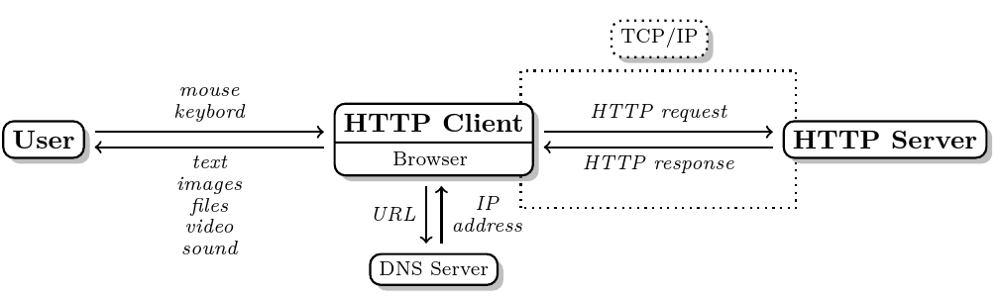
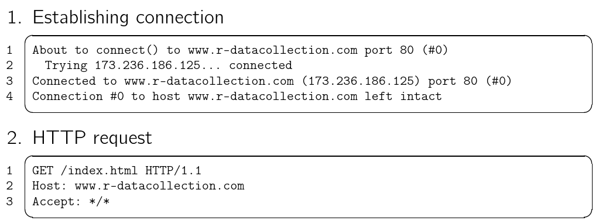
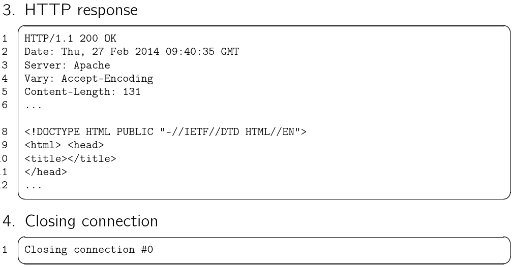
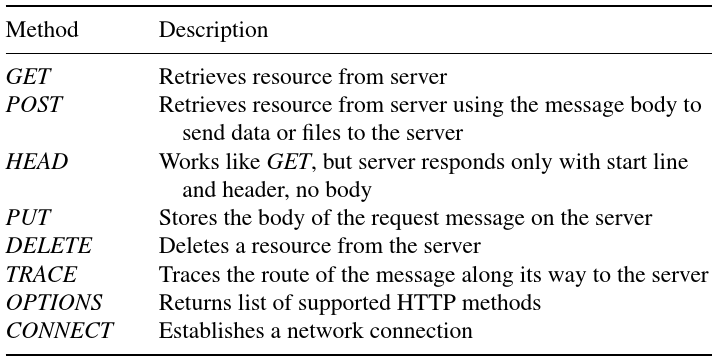
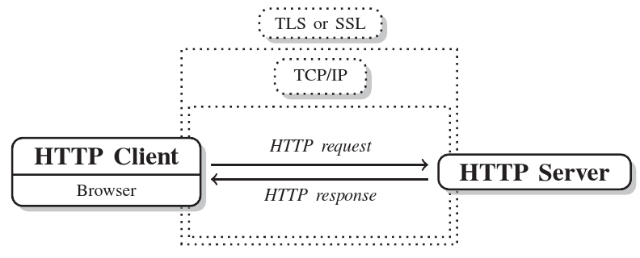

# Teaser

## URL example

https://en.wikipedia.org/wiki/Lion
http://r-datacollection.com

400 page not found
503 intenal server error
200 ok


## things returned by httr functions
```{r, cache=TRUE}
library(httr)

res <- GET("example.com")

names(res)
res$url
res$status_code
```


## client server communication




## HTTP requests




## HTTP responses



## HTTP requests


## HTTP responses


## HTTP methods




## GET and POST

- the same but GET puts all the information in the query string while POST puts the information in the body of the request 

## Error codes 

- 1xx : information
- 2xx : ok
- 3xx : redirect
- 4xx : client error
- 5xx : server error


## Cookies 

1) client request to server
2) server response with header field "Set-Cookie: sessionid=1234; path=/; domain=r-datacollection.com; expires=Mon, 31-Dec-2035 23:00:01 GMT"
3) client request repeating the cookie values: `Cookie: sessionid=1234`


## Identification

- useragent (e.g. R 3.2.3 / httr 1.0.0)
- referer (Last_Page_I_Visited.html)
- from (e.g. bot@botnet.com)
- cookie (user=0112343asas)

## HTTPs




## HTTP and httr

- httr is a wrapper package to the curl package
- httr functions mirror HTTP methods (GET, POST, PUT, DELETE, ...)
- httr tries to have very reasonable defaults (e.g. handles cookies by default, follows redirections, ...)
- httr functions return the whole communication (request, response)


## HTTP and httr - queries
```{r}
library(httr)
library(rvest)
```

## HTTP and httr - queries
```{r}
url <- "http://www.r-datacollection.com/materials/http/GETexample.php"

GET(url) %>% content(as="text") %>% cat()

GET(url, query = list(name="Joy", age="22"))  %>% 
  content(as="text") %>% cat()
```


## HTTP and httr - useragent

```{r}
url <- "http://www.r-datacollection.com/materials/http/return.php"

GET(url) %>% content(as="text") %>% cat()
```


## HTTP and httr - useragent

```{r}
GET(url, user_agent("httr")) %>% content(as="text") %>% cat()
```


## HTTP and httr - auto parsing

```{r}
url <- "http://www.r-datacollection.com/materials/html/OurFirstHTML.html"

GET(url)  %>% content() %>% 
  html_nodes("title") %>% 
  html_text()
GET(url)  %>% content(as="text")
```


## HTTP and httr - follow location

```{r}
url <- "http://www.r-datacollection.com/materials/http/redirect.php"
try(readLines(url))

GET(url)  %>% content(as="text")
```


## HTTP and httr - (auto) cookies

```{r}
url <- "http://www.r-datacollection.com/materials/http/Cookies.php"

content(GET(url))
content(GET(url))
```


## HTTP and httr - methods

```{r}
url <- "http://www.r-datacollection.com/materials/http/returnquery.php"

GET(url, query=list(a=1,b=3)) %>% content(as="text") %>% cat()
```

## HTTP and httr - methods
```{r}
url <- "http://www.r-datacollection.com/materials/http/returnquery.php"

POST(url, body = list(a=1,b=3)) %>% content(as="text") %>% cat()
```

## HTTP and httr - headers
```{r}
url <- "http://www.r-datacollection.com/materials/http/return.php"

GET(url, add_headers(from="bot@botnet.de", referrer="botnet.de")) %>% 
  content(as="text") %>% cat()
```


