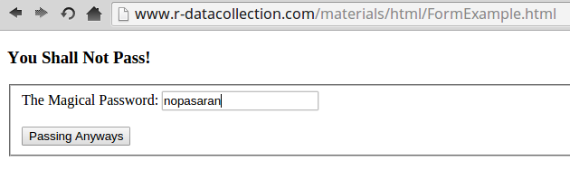

# HTML Forms

## How HTML forms work

- HTML forms are a collection of HTML nodes/tags (`<form>, <input>, <select>, <textfield>`)
- those elements 
    -  collect data as textfields, radio buttons, calenders, checkmarks, ....
    - describe location
    - and HTTP method with which 
    - data is to be send 
- html forms are a way to interact with the server
- [http://www.r-datacollection.com/materials/html/InputTypes.html](http://www.r-datacollection.com/materials/html/InputTypes.html)

## HTML forms



## HTML forms

```html
<!DOCTYPE html>
<html>
  <head>
  <title>No pasaran!</title>
  </head>
  <body>
    <h3 id="heading" >You Shall Not Pass!</h3>
    <form name="submitPW" action="Passed.html" method="get">
      <fieldset>
        The Magical Password: 
        <input name="pw" type="text" value="">
        <input type="submit" value="Passing Anyways">
      </fieldset>
    </form>
  </body>
</html>
```

## HTML forms

important information about HTML form to fill out and send forms

- which method does it demand - POST or GET -> use httr's `GET()` and `POST()` respectively
- if method POST is used, is a enctype given ('application/x-www-form-urlencoded' is the default and 'multipart/form-data' the one that should be used when uploading any kind of file) -> use httr function's `encode="form"` or `encode="multipart"`
- which are the inputs (inputs can be <input>, <textarea>, <selection> there parameter name is given by the name attribute) -> use either httr's `GET(..., query=list(param1="value", param2="value2"))` or `POST(..., )`
- where should the data be end to (the value of the action attribute) -> use it as URL in your function call


