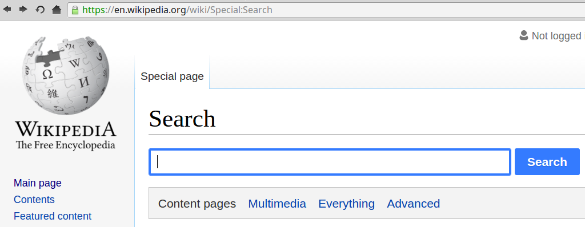

# Wikipedia general search 


## HTML forms

http://en.wikipedia.org/w/index.php?title=Special%3ASearch




## inspecting the search bar

```html
<form id="search" method="get" action="/w/index.php">
  <input type="hidden" value="Special:Search" name="title">
  <input type="hidden" value="default" name="profile">
  <input id="searchText" size="50" class="mw-ui-input mw-ui-input-inline" type="search" value="globbel" name="search" autocomplete="off">
  <input type="hidden" value="Search" name="fulltext">
  <input class="mw-ui-button mw-ui-progressive" type="submit" value="Search">
</form>
```

https://en.wikipedia.org/w/index.php?title=Special%3ASearch&profile=default&search=franken&fulltext=Search


## inspecting the search bar

```{r, message=FALSE}
require(rvest)
url <- "http://en.wikipedia.org/w/index.php?title=Special%3ASearch"
html <- read_html(url)
```

## inspecting the serach bar

```{r}
# ADCR: page 236
attr_inspector <- function(parsed_html, xpath){
  x <- html_nodes(parsed_html, xpath=xpath)
  x <- html_attrs(x)
  x <- lapply(x, function(x) as.data.frame(t(x)) )
  do.call(plyr::rbind.fill, x)
}

attr_inspector(html, "//form")
```

## inspecting the serach bar
```{r}
attr_inspector(html, "//form[1]//input")[,1:5]
```


## filling out forms
```{r, eval=1:4, message=FALSE}
require(stringr)
url1 <- str_c(url, "&search=Peter")
url2 <- str_c(url, "&search=Peter","&fulltext=search")
url3 <- "http://en.wikipedia.org/w/index.php?search=Peter&fulltext=search"
browseURL(url1)
browseURL(url2)
browseURL(url3)
```


## filling out forms - more elegant

```{r, message=FALSE}
require(httr)
url  <- "http://en.wikipedia.org/w/index.php"
resp <- 
  GET(url, 
      query = list(
        title   = "Special:Search",
        profile = "default",
        search  = "Bamberg",
        fulltext= "search"
      )
  )
```


## filling out forms - more elegant

```{r}
xpath = "//*[@class='mw-search-result-heading']/a"
results <- 
html_attr(
  html_nodes(
    content(resp, "parsed"), 
    xpath=xpath
  ), "title" )
```


