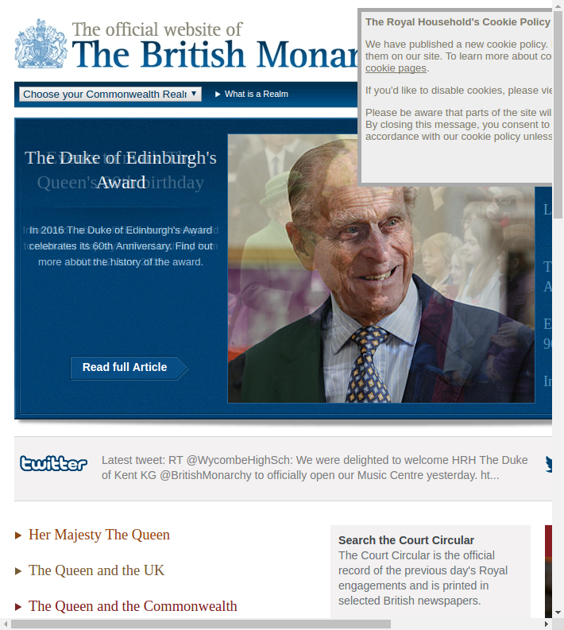

# The Queens Christmas Speeches

## Teaser

- god ssave the queen

## some preparations
```{r, message=FALSE}
require(stringr)
require(RSelenium)
require(rvest)
require(wordcloud)
```

## some preparations
```{r, eval=FALSE}
url1 <- "http://www.royal.gov.uk/ImagesandBroadcasts"
url2 <- "/TheQueensChristmasBroadcasts/ChristmasBroadcasts"
url3 <- "/ChristmasBroadcast"
base_url <- str_c(url1, url2, url3)

# make directory to save files in 
dir.create("Queens_Speeches", showWarnings = F)
```


## starting up engines
```{r, message=FALSE, cache=TRUE, eval=FALSE}
checkForServer() # search for and download Selenium Server java binary.  Only need to run once.
# linux: https://christopher.su/2015/selenium-chromedriver-ubuntu/
# windows: make sure to use Java 64bit for R 64Bit !!!
```

## starting up engines
```{r, eval=FALSE}
startServer() # run Selenium Server binary
remDr <- remoteDriver(browserName="chrome", port=4444)
remDr$open()
remDr$navigate("http://www.royal.gov.uk/") 
remDr$navigate("http://example.com") 

?remoteDriver
```


## screen shot
```{r, eval=FALSE}
remDr$screenshot(display = F, 
                 useViewer=F, 
                 file="screen2.png")
```

## screen shot



## getting speeches
```{r, eval=FALSE}
for(i in 1953:2015){
  url <- str_c(base_url, i, ".aspx")
  remDr$navigate(url)   
  
  html   <- remDr$getPageSource()[[1]]
  parsed <- htmlParse(html)
  speech <- xpathSApply(parsed, 
                        '//div[@id="content"]/p', 
                        xmlValue)
  speech_short <- speech[2:length(speech)]
  write(speech_short, str_c("Queens_Speeches/", i, ".txt"))
}
```

## text
```{r}
text  <- str_c(readLines("Queens_Speeches/2014.txt"),
               collapse="\n")
substring(text, 1, 150)
```

## some cleansing
```{r, message=FALSE}
library(tm)
corpus <- tolower(text)
corpus <- removeNumbers(corpus)
corpus <- removeWords(corpus, stopwords('english'))
corpus <- stemDocument(corpus)
```

## word frequencies
```{r}
words <- unlist(str_split(corpus, "\\W"))
words <- words[words!="" & words!=" "]
tail(sort(table(words)),10)
```


## wordclouds
```{r, eval=FALSE}
colors <- c("#CD8B34", "#89B151", "#01ABE9", 
            "#1B346C", "#F54B1A", "#4B574D",
            "#609F80", "#AF420A", "#D67236",
            "#FD6467")
wordcloud(words, colors=colors)
```

## wordclouds
```{r, include=FALSE, cache=TRUE}
colors <- c("#CD8B34", "#89B151", "#01ABE9", 
            "#1B346C", "#F54B1A", "#4B574D",
            "#609F80", "#AF420A", "#D67236",
            "#FD6467")
pdf("wc1999.pdf", width=6, height=4)
wordcloud(words, colors=colors)
dev.off()
```


## RSelenium alternative

- rdom / phantom.js
- https://github.com/cpsievert/rdom 

## Live Clicking // Remote Building


